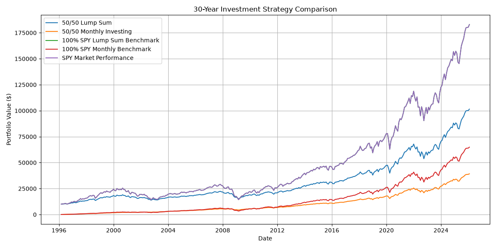
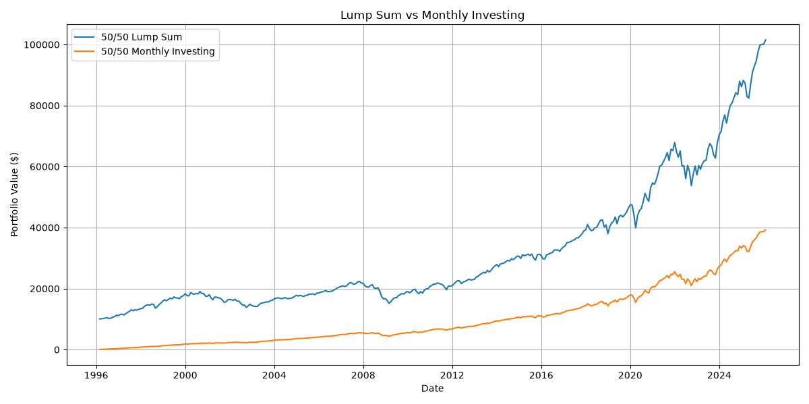
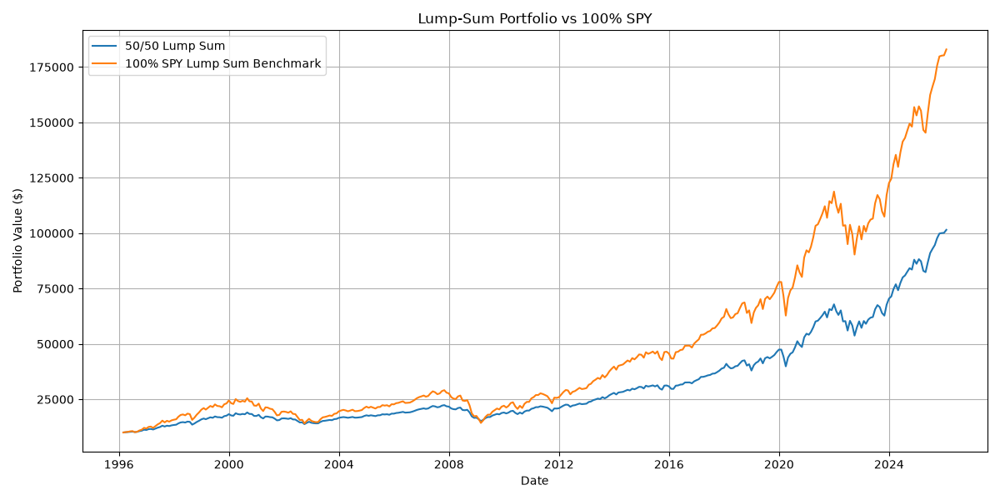
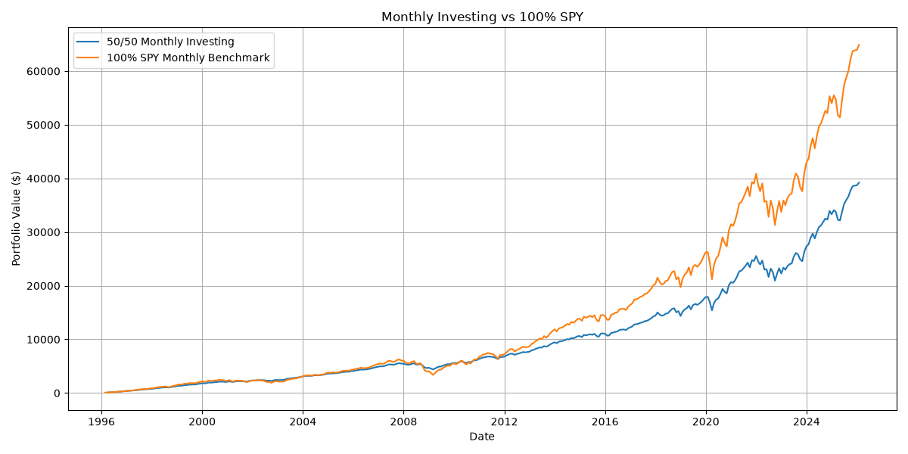

# 30-Year Investment Strategy Backtest

## Overview

This project evaluates the historical performance of a simple two-asset portfolio over a 30-year period, from **February 1996 to January 2026**.

The portfolio is initially allocated as follows:

- **50% SPDR S&P 500 ETF Trust (SPY)**
- **50% 3-Month U.S. Treasury Bills**

Two different capital-deployment approaches are examined:

1. **Lump-Sum Investing** — the entire $10,000 is invested at the beginning of the investment horizon.
2. **Monthly Investing** — the same total nominal amount of $10,000 is invested gradually over 360 months.

For comparison, the same two funding approaches are also applied to a **100% SPY portfolio**.

The purpose of the project is not to identify an optimal portfolio or predict future returns. Instead, it examines how **asset allocation, investment timing, compounding, volatility, risk-adjusted performance, and drawdowns** affect long-term investor outcomes.

---

## Research Questions

The project focuses on two main questions:

1. How does investing capital immediately compare with gradually investing the same nominal amount over a 30-year period?
2. How does an initially diversified 50/50 SPY–Treasury Bill portfolio compare with full equity exposure in terms of long-term wealth, volatility, risk-adjusted performance, and downside risk?

---

## Portfolio Construction

### Primary Portfolio

The portfolio begins with:

- **50% SPY**
- **50% 3-Month U.S. Treasury Bills**

The initial allocation can be expressed as:

\[
Portfolio = 0.50(SPY) + 0.50(TBills)
\]

The portfolio is **not periodically rebalanced back to 50/50**.

This means that the asset weights are allowed to drift over time as SPY and Treasury Bills generate different returns.

For the monthly-investing strategy, however, every new contribution is split equally between SPY and Treasury Bills.

Therefore, the portfolio is more accurately described as:

> **An initially 50/50 portfolio with no explicit periodic rebalancing.**

---

## Investment Strategies

### Strategy 1 — 50/50 Lump Sum

The full $10,000 is invested at the beginning of the period:

- $5,000 in SPY
- $5,000 in 3-Month Treasury Bills

No additional capital is contributed.

### Strategy 2 — 50/50 Monthly Investing

The same total nominal capital of $10,000 is invested progressively over 360 months.

\[
Monthly\ Contribution = \frac{10,000}{360}
\]

Each monthly contribution is split equally:

- 50% to SPY
- 50% to Treasury Bills

This strategy represents gradual capital accumulation rather than immediate full deployment of the $10,000.

---

## Benchmarks

Two matched equity benchmarks are included.

### 100% SPY Lump Sum

The entire $10,000 is invested in SPY at the beginning of the 30-year period.

### 100% SPY Monthly

The same total nominal amount of $10,000 is invested progressively into SPY using the monthly-contribution schedule.

These benchmarks help distinguish between two separate effects:

- **Capital deployment timing**
- **Asset allocation**

---

## Data Sources

### SPY

SPY is used as an investable proxy for large-cap U.S. equity exposure.

Historical market data are retrieved from **Yahoo Finance** through the `yfinance` Python package.

The project uses:

```python
auto_adjust=True
```

so that the downloaded price history is adjusted for relevant corporate distributions.

Daily observations are converted to month-end prices before monthly returns are calculated.

### 3-Month U.S. Treasury Bills

The defensive component of the portfolio uses the FRED series:

```text
TB3MS
```

This series represents the **3-Month Treasury Bill Secondary Market Rate, Discount Basis**.

The series is monthly, expressed in percentage terms, and represents a quoted yield rather than a directly observed total-return index.

For this reason, the project converts the quoted Treasury Bill yield into an estimated monthly return.

---

## Methodology

### 1. Monthly SPY Return

Monthly SPY returns are calculated using:

\[
R_t = \frac{P_t}{P_{t-1}} - 1
\]

where:

- \(P_t\) is the current adjusted month-end price
- \(P_{t-1}\) is the previous adjusted month-end price

### 2. Treasury Bill Yield Conversion

The FRED Treasury Bill rate is initially expressed as a percentage and is converted into decimal form:

\[
d_t = \frac{TB3MS_t}{100}
\]

### 3. Treasury Bill Price Approximation

The project assumes a normalized face value of 1 and an approximate maturity of 91 days.

\[
P_t = 1 - d_t \frac{91}{360}
\]

### 4. Three-Month Treasury Bill Return

The implied three-month holding-period return is:

\[
R_{3M,t} = \frac{1}{P_t} - 1
\]

### 5. Equivalent Monthly Treasury Bill Return

The three-month return is converted into an equivalent monthly compounded return:

\[
R_{TB,t} = (1 + R_{3M,t})^{1/3} - 1
\]

This synthetic monthly Treasury return is used both:

- as the return of the defensive asset
- as the risk-free proxy for the Sharpe ratio

### 6. Portfolio Value

For each asset, portfolio value evolves according to:

\[
V_t = V_{t-1}(1 + R_t)
\]

The total portfolio value is:

\[
V_{Portfolio,t} = V_{SPY,t} + V_{TBill,t}
\]

---

## Performance Metrics

### Annualized Time-Weighted Return

Monthly returns are compounded across the entire sample.

\[
TWR_{annual} =
\left(
\prod_{t=1}^{N}(1+R_t)
\right)^{12/N}
-1
\]

TWR is useful because it measures the performance of the investment strategy while reducing the influence of external cash-flow timing.

### Annualized Volatility

\[
\sigma_{annual} = \sigma_{monthly}\sqrt{12}
\]

This measures the overall variability of returns.

### Sharpe Ratio

Treasury Bill returns are used as the risk-free proxy.

Monthly excess returns are:

\[
ER_t = R_{Portfolio,t} - R_{f,t}
\]

The annualized Sharpe ratio is:

\[
Sharpe =
\frac{\overline{ER}}{\sigma(ER)}
\sqrt{12}
\]

### Maximum Drawdown

A cumulative wealth index is first calculated from monthly returns.

Drawdown is measured as the decline from the previous historical peak:

\[
DD_t = \frac{W_t}{Peak_t} - 1
\]

Maximum drawdown is the largest peak-to-trough decline observed during the sample.

---

## Backtest Period

The final dataset contains exactly **360 monthly return observations**, covering:

**February 1996 to January 2026**

This corresponds to a full 30-year historical investment horizon.

---

# Results

## Performance Summary

| Strategy | Contributions | Final Value | Investment Gain | Annualized TWR | Volatility | Sharpe | Max Drawdown |
|---|---:|---:|---:|---:|---:|---:|---:|
| 50/50 Lump Sum | $10,000 | $101,504 | $91,504 | 8.03% | 10.41% | 0.57 | -32.36% |
| 50/50 Monthly | $10,000 | $39,218 | $29,218 | 7.50% | 9.20% | 0.58 | -27.69% |
| 100% SPY Lump Sum | $10,000 | $182,947 | $172,947 | 10.17% | 15.19% | 0.56 | -50.78% |
| 100% SPY Monthly | $10,000 | $64,894 | $54,894 | 10.17% | 15.19% | 0.56 | -50.78% |

---

## Overall Strategy Comparison



This chart provides an overview of the long-term wealth paths of the four strategies.

For the final version of the chart, only one representation of the 100% SPY lump-sum performance should be included, because a normalized SPY wealth series based on $10,000 is effectively identical to the 100% SPY Lump-Sum benchmark.

---

## 1. Final Portfolio Value and Time in the Market

The **100% SPY Lump-Sum strategy** generated the highest terminal wealth.

An initial investment of **$10,000 grew to approximately $182,947** over the 30-year period.

The **50/50 Lump-Sum portfolio** also benefited strongly from long-term compounding, finishing at approximately **$101,504**.

The monthly-investing strategies produced lower final wealth:

- **50/50 Monthly:** approximately $39,218
- **100% SPY Monthly:** approximately $64,894

The main explanation is **time in the market**.

Under the lump-sum strategies, the full $10,000 was invested from the beginning.

Under the monthly strategies, only a small amount of capital was invested during the early years, while much of the $10,000 entered the market much later.

As a result, the lump-sum capital had substantially more time to compound.

### Lump Sum vs Monthly Investing



This chart illustrates how the wealth gap widens as the earlier-invested capital benefits from longer compounding.

However, this result should **not** be interpreted as proof that lump-sum investing will always outperform DCA.

The two investors do not begin with the same amount of immediately available capital.

---

## 2. Time-Weighted Return

Annualized TWR was:

- **50/50 Lump Sum:** 8.03%
- **50/50 Monthly:** 7.50%
- **100% SPY:** 10.17%

One of the most important findings is that the two 100% SPY strategies have the **same annualized TWR of 10.17%**, even though their final wealth is dramatically different.

The reason is simple: both strategies are exposed to the same underlying SPY return series.

The difference in final wealth is caused by the timing of investor contributions.

This demonstrates an important distinction:

> **Investment performance and investor wealth are not the same thing.**

A strategy can experience the same underlying asset return while producing very different terminal wealth depending on when the investor's money enters the market.

The two 50/50 strategies have slightly different TWRs because their effective asset allocations evolve differently over time.

The lump-sum portfolio is allowed to drift from its original 50/50 weights.

The monthly strategy also experiences drift, but every new contribution is again split 50/50, which partially influences the portfolio back toward the original allocation.

---

## 3. Volatility

Annualized volatility was:

- **50/50 Lump Sum:** 10.41%
- **50/50 Monthly:** 9.20%
- **100% SPY:** 15.19%

The Treasury Bill allocation materially reduced portfolio volatility.

Compared with the 100% SPY benchmark, the 50/50 Lump-Sum portfolio experienced approximately **31% lower annualized volatility**.

The 50/50 Monthly portfolio exhibited the lowest volatility of the strategies tested.

This demonstrates one of the central benefits of diversification:

> A portfolio may sacrifice part of its long-term upside in exchange for a more stable return path.

---

## 4. Sharpe Ratio

Sharpe ratios were:

- **50/50 Lump Sum:** 0.57
- **50/50 Monthly:** 0.58
- **100% SPY:** 0.56

The fully invested SPY strategies produced substantially more absolute wealth.

However, they did not produce a meaningfully higher return per unit of measured risk.

The diversified portfolios achieved Sharpe ratios that were broadly comparable to the full-equity benchmark.

This highlights an important portfolio-management principle:

> The strategy with the highest absolute return is not necessarily the strategy with the best risk-adjusted performance.

The differences between Sharpe ratios of 0.56, 0.57, and 0.58 are very small.

Therefore, this project does **not** provide sufficient evidence to claim that one strategy is statistically superior on a Sharpe-ratio basis.

---

## 5. Maximum Drawdown

Maximum drawdown produced one of the clearest differences between the strategies.

The results were:

- **50/50 Monthly:** -27.69%
- **50/50 Lump Sum:** -32.36%
- **100% SPY:** -50.78%

The fully invested equity portfolio experienced a peak-to-trough decline of more than half its value during the worst historical drawdown.

By contrast, the Treasury Bill allocation substantially reduced the severity of portfolio losses.

The 50/50 Lump-Sum portfolio reduced maximum drawdown from approximately **-50.8% to -32.4%**.

The 50/50 Monthly strategy experienced an even smaller maximum drawdown of approximately **-27.7%**.

This is one of the strongest findings of the project.

The defensive Treasury allocation did not maximize wealth, but it substantially reduced downside exposure.

---

## 6. Lump-Sum Asset Allocation Comparison

### 50/50 Lump Sum vs 100% SPY Lump Sum



The 100% SPY Lump-Sum strategy generated significantly more long-term wealth.

However, this additional return came with:

- higher volatility
- a much deeper maximum drawdown
- no meaningful improvement in the Sharpe ratio

The comparison therefore illustrates a classic risk-return trade-off.

The investor who remained fully exposed to equities achieved greater long-term growth but had to tolerate significantly larger losses along the way.

---

## 7. Monthly Strategy Comparison

### 50/50 Monthly vs 100% SPY Monthly



The fully invested monthly SPY strategy finished at approximately **$64,894**, compared with approximately **$39,218** for the diversified monthly portfolio.

Once again, greater equity exposure produced higher long-term wealth.

However, the diversified portfolio experienced both lower volatility and a smaller maximum drawdown.

The same fundamental trade-off therefore appears under both funding approaches:

> More equity exposure increased long-term growth but also increased risk.

---

# Key Findings

The historical analysis supports the following conclusions.

### 1. Full equity exposure generated the highest terminal wealth

Over this specific 30-year period, remaining fully invested in SPY produced the strongest long-term growth.

### 2. Earlier capital deployment created a major compounding advantage

Capital invested at the beginning of the sample had decades more time to participate in market appreciation and compound returns.

### 3. Treasury Bills materially reduced risk

The diversified portfolios experienced substantially lower volatility and significantly smaller maximum drawdowns.

### 4. Higher absolute returns did not generate meaningfully higher Sharpe ratios

SPY produced much greater terminal wealth, but the diversified portfolios achieved broadly comparable risk-adjusted performance.

### 5. Final wealth and TWR measure different things

The timing of investor cash flows can create very different terminal wealth even when the underlying investment return is identical.

### 6. Diversification primarily improved the risk profile

The Treasury Bill allocation reduced long-term growth but also reduced volatility and downside severity.

### 7. Capital deployment and asset allocation are separate investment decisions

The project demonstrates that both **what an investor owns** and **when capital is invested** materially affect long-term outcomes.

---

# What the Results Do Not Prove

The analysis does not establish that:

- lump-sum investing will always outperform periodic investing
- a 50/50 SPY–Treasury portfolio is an optimal portfolio
- a 50% Treasury allocation is appropriate for every investor
- SPY will continue to generate returns similar to the historical sample
- the relationships observed from 1996 to 2026 will persist in other market regimes
- the small differences in Sharpe ratios are statistically significant

This is a **historical backtest, not a forecasting model**.

---

# Methodological Limitations

## 1. Single Historical Window

The analysis evaluates only one 30-year historical period.

Different starting dates could produce significantly different outcomes.

A stronger empirical extension would examine multiple rolling 30-year windows.

## 2. Lump Sum vs Monthly Capital Availability

The lump-sum investor has the full $10,000 available at the beginning.

The monthly investor contributes the same nominal total gradually over time.

This means that the comparison reflects both:

- investment timing
- capital availability

A stricter DCA experiment would assume that both investors possess the entire $10,000 at the beginning, while the DCA investor temporarily holds the uninvested balance in a cash-equivalent instrument.

## 3. No Explicit Rebalancing

The portfolio begins at 50/50 but is not periodically restored to those weights.

The allocation therefore drifts over time.

The monthly strategy also receives new contributions at a 50/50 split, which means its asset-allocation path differs from that of the lump-sum strategy.

## 4. Synthetic Treasury Bill Returns

The FRED `TB3MS` series is a quoted yield series rather than a Treasury total-return index.

Monthly Treasury returns are estimated using the quoted discount yield and simplifying assumptions.

## 5. Fixed 91-Day Treasury Assumption

The model assumes a 91-day maturity for every 3-Month Treasury Bill.

Actual maturities can differ slightly.

## 6. Data Source Limitations

SPY data are obtained through Yahoo Finance using the open-source `yfinance` package.

This approach was chosen because it is accessible and reproducible.

A professional institutional implementation could use official fund data or institutional market-data providers.

## 7. No Transaction Costs or Taxes

The model does not explicitly account for:

- transaction costs
- bid-ask spreads
- brokerage commissions
- taxation
- investor-specific tax treatment

The reported results should therefore be interpreted as a simplified pre-tax historical simulation.

## 8. Inflation

Portfolio values are reported in nominal U.S. dollars.

No adjustment for inflation or purchasing power is included.

## 9. Sharpe Ratio Interpretation

The Sharpe ratios are historical sample estimates.

Small numerical differences should not automatically be interpreted as meaningful differences in investment quality.

---

# Potential Extensions

Possible future extensions include:

- rolling 30-year backtests
- money-weighted return / XIRR
- Sortino ratio
- explicit periodic rebalancing
- inflation-adjusted returns
- transaction-cost modelling
- alternative portfolio allocations
- Treasury total-return indices
- statistical testing of risk-adjusted performance
- sensitivity analysis
- stress testing

These extensions are intentionally excluded from the current version in order to keep the project focused on a simple historical comparison of capital deployment and asset allocation.

---

# Conclusion

Over the February 1996 to January 2026 period, the **100% SPY Lump-Sum strategy** generated the highest terminal wealth.

An initial $10,000 investment grew to approximately **$182,947**.

However, this result was accompanied by the highest level of measured risk, with annualized volatility of **15.19%** and a maximum drawdown of approximately **-50.78%**.

The initially 50/50 SPY–Treasury Lump-Sum portfolio finished at approximately **$101,504**.

Its annualized volatility was lower at **10.41%**, while its maximum drawdown was reduced to approximately **-32.36%**.

Despite generating less absolute wealth, its Sharpe ratio remained broadly comparable to that of the fully invested equity benchmark.

The monthly strategies produced lower terminal wealth primarily because capital entered the market gradually and therefore had less time to compound.

The project therefore highlights three central investment concepts:

1. **Time in the market**
2. **Diversification and the risk-return trade-off**
3. **Investment performance versus investor cash-flow outcome**

The main conclusion is not that one strategy is universally superior.

Rather, the analysis demonstrates that long-term portfolio decisions involve competing objectives: maximizing long-term growth, controlling downside risk, and deciding when capital becomes exposed to the market.

A portfolio should therefore be evaluated not only by its final value, but also by the amount and type of risk required to achieve that outcome.

---

# References and Data Sources

1. **State Street Global Advisors — SPDR S&P 500 ETF Trust (SPY)**  
   Official information on the ETF, its investment objective, benchmark, inception date, and characteristics.

2. **Yahoo Finance / yfinance**  
   Historical SPY market data were accessed programmatically through the `yfinance` Python package.

3. **Federal Reserve Economic Data (FRED) — TB3MS**  
   3-Month Treasury Bill Secondary Market Rate, Discount Basis.  
   Source: Board of Governors of the Federal Reserve System.

4. **U.S. Department of the Treasury — TreasuryDirect**  
   Treasury Bill pricing conventions were used as the basis for the synthetic Treasury-return calculation.

5. **Sharpe, William F. (1994), “The Sharpe Ratio,” Journal of Portfolio Management**  
   Used as the conceptual basis for interpreting risk-adjusted performance.

---

# Disclaimer

This project is intended for **educational and research purposes only**.

It does not constitute investment advice, a recommendation to buy or sell securities, or a forecast of future market performance.

Historical performance does not guarantee future results.
